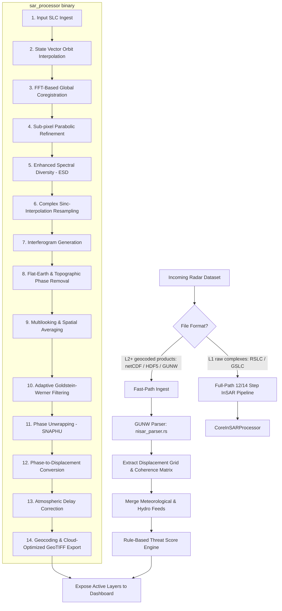

# NISARPro Platform Architecture & Ecosystem Blueprint

This document outlines the hybrid topology, processing pipelines, mathematical foundations, and data acquisition pathways of the NISARPro Synthetic Aperture Radar (SAR) analytics platform. 

This architecture is optimized to solve the two biggest bottlenecks in modern geospatial intelligence: **data gravity** (large file size of SAR products) and **strict data sovereignty requirements** (critical infrastructure telemetry cannot be uploaded to third-party cloud servers).

---

## 1. High-Level System Topology

NISARPro employs a **Hybrid Edge-Cloud Topology**. The control plane is delivered via a global web application, while all data storage, extraction, and CPU-bound radar processing happen locally on the operator’s secure hardware.

```mermaid
graph TD
    subgraph Global Cloud [Global Cloud Control Plane]
        Dashboard[React SPA Dashboard<br/>GitLab Pages / Vercel]
    end

    subgraph Scientific APIs [Authoritative Data Providers]
        NASA_ASF[NASA ASF STAC API<br/>SAR Scene Catalog]
        USGS_Seismic[USGS STAC API<br/>Live Seismic Events]
        OpenMeteo[Open-Meteo API<br/>Precipitation & Soil Moisture]
        CWC_WRIS[CWC & India-WRIS API<br/>Reservoir Level Bulletins]
    end

    subgraph Local Secure Environment [Operator Local Hardware]
        Gateway[Rust API Gateway<br/>sar-gateway - Axum/Tokio]
        Processor[Rust Compute Engine<br/>sar_processor - Multithreaded CLI]
        HDF5_Storage[Local Storage<br/>netCDF4 / HDF5 / SAFE Files]
        COG_Server[Local COG Streamer<br/>Cloud-Optimized GeoTIFF Tile Server]
    end

    %% Communications
    Dashboard <-->|1. HTTPS / Localhost loopback| Gateway
    Dashboard <-->|2. HTTPS / Metadata Queries| Scientific APIs
    Gateway <-->|3. Ingest Stream / Chunked Download| NASA_ASF
    Gateway <-->|4. Sync Context Telemetry| OpenMeteo
    Gateway <-->|4. Sync Context Telemetry| USGS_Seismic
    Gateway <-->|4. Sync Context Telemetry| CWC_WRIS
    Gateway <-->|5. Spawns Subprocess / Streams SSE Logs| Processor
    Processor <-->|6. Reads & Writes| HDF5_Storage
    HDF5_Storage <-->|7. Streams Tiles| COG_Server
    COG_Server <-->|8. Render Tile Layer| Dashboard
```

### Key Architectural Decisions for YC Investors:
1. **Zero Data Upload Policy:** Raw Sentinel-1 or NISAR acquisitions (ranging from 5GB to 30GB per scene) remain on-premise. The browser communicates with `localhost:3000` via loopback, ensuring that classified or sensitive government infrastructure data is never uploaded to our servers.
2. **Server-Sent Events (SSE) Streaming:** Heavy processor operations are executed asynchronously by the Rust backend. Real-time stdout logs and step completions are streamed directly to the frontend via SSE, preventing HTTP timeouts.
3. **Cloud-Optimized GeoTIFFs (COG):** The compute engine writes output arrays directly into internally tiled GeoTIFFs, enabling the React frontend to zoom into sub-meter coordinates smoothly using tile streaming without loading gigabyte-scale images into memory.

---

## 2. Ingestion & Alert Context Flow

To move from "raw GIS mapping" to "actionable decision support," NISARPro correlates physical displacement trends with live environmental and hydrological telemetry.

```mermaid
sequenceDiagram
    autonumber
    actor Operator
    participant Dashboard as React Dashboard
    participant Gateway as Rust Gateway (Axum)
    participant Processor as Rust Processor (HDF5)
    participant Scientific as External APIs (USGS/Meteo)

    Operator->>Dashboard: Trigger Ingestion & Risk Analysis
    Dashboard->>Gateway: POST /asf/download-stream (Initiate download)
    Gateway->>Scientific: GET Chunked Stream (Download HDF5/NetCDF)
    Scientific-->>Gateway: HDF5 Bytes
    Gateway-->>Dashboard: SSE Stream (Download Progress %)
    Gateway->>Processor: Spawn process (Analyze HDF5 payload)
    
    rect rgb(10, 20, 30)
        Note over Processor: Read Displacement Grid & Coherence
    end
    
    Processor-->>Gateway: Geolocation Coordinates & Bounding Box
    Gateway->>Scientific: GET /context (USGS Seismic, Open-Meteo Rain, CWC Water Levels)
    Scientific-->>Gateway: Telemetry payload (e.g. 72h Rain, Seismic magnitude)
    
    rect rgb(30, 20, 10)
        Note over Gateway: Risk Aggregator Engine
        Note over Gateway: threat_score = f(displacement, soil_saturation, hydrostatic_head)
    end
    
    Gateway-->>Dashboard: SSE Emit (Georef BBox + Active Telemetry + Threat Score)
    Dashboard-->>Operator: Render Map Layers + Dispatch Threat Alert Toast
```



### Integrated Scientific Data Sources:
* **NASA ASF (Alaska Satellite Facility):** Pulls metadata catalogs and HDF5 download streams for Sentinel-1 and NISAR.
* **Open-Meteo:** Gathers cumulative 72h precipitation values and calculated soil moisture percentages within the Area of Interest (AOI) to evaluate rainfall-induced landslide/subsidence triggers.
* **USGS (United States Geological Survey):** Tracks active seismic anomalies and magnitude events within a 100km radius of the monitored asset.
* **Central Water Commission (CWC) & India-WRIS (Roadmapped Module):** Standardized adapter to ingest daily water levels, reservoir volume capacities, and hydrostatic loads to cross-reference dam wall deflections.

---

## 3. Dual-Path InSAR Pipeline Engine

The platform operates on two distinct processing pathways, optimized for different file formats and operational latencies.



### Pathway A: Fast-Path Ingest (Active Production Path)
* **Goal:** Real-time threat detection from pre-processed products.
* **Logic:** If the ingested file contains pre-computed, geocoded displacement layers (such as ARIA/NASA GUNW products), the engine bypasses expensive signal focus computations. The `nisar_parser.rs` script extracts the unwrapped deformation layers directly, correlating them with live meteorological alerts.

### Pathway B: Full 12/14 Step InSAR Core Processor
* **Goal:** Custom interferogram generation and raw phase processing.
* **Logic:** When working with raw Single Look Complex datasets (Sentinel-1 SLC or NISAR RSLC), the core Rust processing engine executes the full stack of radar mathematical steps.
* **RSLC Cropped File Testing (Roadmap/Future Phase):** Raw NISAR RSLC files are massive (up to 30GB+). Full scene coregistration on raw datasets requires high performance compute grids. In the next development milestone, we will deploy tests on cropped subsets of NISAR RSLC files (focused regions around specific dams) to validate the custom 12/14 step coregistration and phase unwrapping algorithms locally without crashing standard operator workstations.

---

## 4. The 12/14 InSAR Processing Steps (Technical Breakdown)

For raw complex focusing, the processor executes the following mathematical sequence:

1. **Input SLC Ingest:** Ingests dual polarizations (VV/VH or HH/HV) of the Master and Slave Single Look Complex (SLC) acquisitions.
2. **State Vector Orbit Interpolation:** Reads orbital state vectors from metadata files to reconstruct the satellite's exact flight trajectory during pulse transmission.
3. **FFT-Based Global Coregistration:** Employs 2D Fast Fourier Transforms (FFT) to determine the coarse pixel shift (offset) between the Master and Slave scenes.
4. **Sub-pixel Parabolic Refinement:** Computes correlation amplitudes around the coarse peak and fits a 2D parabola to achieve sub-pixel image alignment accuracy ($< 0.1$ pixel).
5. **Enhanced Spectral Diversity (ESD):** Evaluates phase differences in the overlap region of adjacent radar bursts to correct residual azimuth sub-pixel alignment errors.
6. **Complex Sinc-Interpolation Resampling:** Resamples the Slave SLC grid to align precisely with the Master SLC geometry using a high-fidelity 8-point Sinc interpolator.
7. **Interferogram Generation:** Computes the complex conjugate multiplication of the coregistered images:
   $$I(x, y) = M(x, y) \cdot S^*(x, y)$$
   where the resulting phase represents the sum of topographic, deformation, atmospheric, and noise components.
8. **Flat-Earth & Topographic Phase Removal:** Removes the systemic reference ellipsoid phase and calculates/subtracts the topographic phase contribution using an external Digital Elevation Model (DEM) like SRTM.
9. **Multilooking & Spatial Averaging:** Averages adjacent pixels in range and azimuth to suppress speckle noise, resulting in square ground pixels and improved Signal-to-Noise Ratio (SNR).
10. **Adaptive Goldstein-Werner Filtering:** Applies a frequency-domain filter with variable alpha parameters ($\alpha = 1.0 - \text{coherence}$) to smooth phase noise in low-coherence regions.
11. **Phase Unwrapping (SNAPHU):** Resolves the $2\pi$ cyclical phase ambiguity $[-\pi, \pi]$ using minimum cost flow network optimization to determine continuous displacement curves.
12. **Phase-to-Displacement Conversion:** Scales the unwrapped phase values into absolute physical deformation metrics in millimeters:
   $$d = \frac{\lambda \cdot \phi}{4\pi}$$
   where $\lambda$ is the radar carrier wavelength (C-band $\approx 5.6\text{cm}$, L-band $\approx 24\text{cm}$).
13. **Atmospheric Delay Correction:** Integrates tropospheric corrections from meteorological models to remove refraction delays caused by atmospheric water vapor.
14. **Geocoding & COG Export:** Projects the displacement array from radar geometry (Range/Azimuth) to WGS84 geographic coordinates, outputting a Cloud-Optimized GeoTIFF (COG) for rapid tile rendering.

---

## 5. Mathematical Foundations of the InSAR Core Engine

To guarantee maximum analytical fidelity, the `sar_processor` compute engine implements high-precision mathematics natively in Rust. Below are the core equations powering our processing modules.

### A. Coherence Estimation (Phase Quality Indicator)
Coherence ($\gamma$) evaluates the local phase correlation between the Master and Slave images in a sliding spatial window. It is computed as:

$$\gamma = \frac{\left| \sum_{i=1}^{N} M_i \cdot S_i^* \right|}{\sqrt{\sum_{i=1}^{N} |M_i|^2 \cdot \sum_{i=1}^{N} |S_i|^2}}$$

Where:
* $M_i$ and $S_i$ are complex pixels of Master and Slave SLCs.
* $S_i^*$ is the complex conjugate of the Slave pixel.
* $N$ is the number of pixels in the local window (typically $5 \times 5$ or $9 \times 9$).
* $\gamma \in [0, 1]$, where $1.0$ represents perfect phase correlation, and values below $0.4$ generally signify decorrelation (vegetation, water bodies, or severe terrain changes).

We accelerated this formula in Rust using **Summed-Area Tables (SAT)**, reducing the time complexity from $O(W^2 \cdot M \cdot N)$ to $O(M \cdot N)$ independent of the coherence window size $W$.

### B. Goldstein-Werner Adaptive Filtering
To filter high-frequency speckle noise before phase unwrapping, the processor applies an adaptive spectral filter. The power spectrum $I(u, v)$ is filtered according to:

$$I_{\text{filtered}}(u, v) = I(u, v) \cdot |I(u, v)|^\alpha$$

Where:
* $(u, v)$ are frequency coordinates within an overlapping Fourier window block.
* $\alpha$ is the adaptive filter parameter calculated from local coherence:
  $$\alpha = 1.0 - \overline{\gamma}$$
* In regions of high coherence ($\overline{\gamma} \to 1.0$), $\alpha \to 0$ (no filtering, preserving edge details).
* In noisy regions ($\overline{\gamma} \to 0$), $\alpha \to 1$ (heavy filtering, smoothing phase noise to assist unwrapping solvers).

### C. Phase-to-Displacement Scaling
Once phase unwrapping translates the wrapped cyclical phase differences back into a continuous map, we calculate actual ground displacement along the satellite's Line of Sight (LOS) using the radar carrier wavelength:

$$d_{\text{LOS}} = \frac{\lambda \cdot \Phi_{\text{unwrapped}}}{4 \pi}$$

For the platform’s dual-mission capabilities:
* **ESA Sentinel-1 (C-band):** $\lambda = 0.05546 \text{ m}$ ($5.55\text{ cm}$). One full phase cycle ($2\pi$ radians) of displacement represents $2.77\text{ cm}$ of ground movement.
* **NASA-ISRO NISAR (L-band):** $\lambda = 0.24 \text{ m}$ ($24\text{ cm}$). L-band has higher penetration (can bypass vegetation canopy cover) but a larger wavelength, meaning one full phase cycle represents $12\text{ cm}$ of movement.

---

## 6. Ecosystem Component Deep Dive

The NISARPro platform is divided into four highly focused modules:

```
                  ┌───────────────────────────────┐
                  │      React SPA Dashboard      │
                  │     (sar-dashboard-v3)        │
                  └───────────────┬───────────────┘
                                  │ Loopback API
                  ┌───────────────▼───────────────┐
                  │       Rust Axum Gateway       │
                  │        (sar-gateway)          │
                  └──────┬─────────────────┬──────┘
                         │                 │
     Local Process Mode  │                 │ Kubernetes Deployment
                  ┌──────▼────────┐   ┌────▼────────────────────────┐
                  │ Rust Compute  │   │  Kubernetes Operator (kube)  │
                  │ (sar_processor│   │      (sar_operator_v2)      │
                  └───────────────┘   └──────────────┬──────────────┘
                                                     │ Schedules Jobs
                                              ┌──────▼────────┐
                                              │  Worker Pods  │
                                              │(sar_processor)│
                                              └───────────────┘
```

### 1. `sar_processor` (Compute Core)
* **Language:** Rust (CPU-optimized, compiled with target-cpu native flags).
* **Concurrency Model:** Uses the `rayon` crate for data-parallel task scheduler stealing. Heavy matrix computations (FFTs, CFAR, multi-looking) are parallelized across all available CPU cores.
* **Dependencies:** Uses `hdf5-rust` for direct C-binding reads of NetCDF and NISAR files without copying array buffers into memory.
* **Outputs:** Automatically writes internally tiled Cloud-Optimized GeoTIFFs (COG) with manual EPSG:4326 metadata tags injection.

### 2. `sar-gateway` (Local API Gateway)
* **Language:** Rust (Axum, Tokio, Hyper, Reqwest).
* **Role:** Serves as the security boundary. It authenticates with NASA Earthdata API, manages download streams directly, handles JSON logging buffers, and translates CLI outputs into a clean REST/SSE API.
* **Asynchronous Execution:** Spawns `sar_processor` using `tokio::process::Command` to prevent event-loop blockages, piping stderr lines to active Server-Sent Events subscribers.

### 3. `sar-dashboard-v3` (Control Center UI)
* **Language/Stack:** React, Vite, Framer Motion, Leaflet, TailwindCSS (for core modules).
* **UX Strategy:** Prioritizes decision support over pure GIS map displays. Immediately flags active alarm conditions, correlation values, and recommended mitigation actions on a left-side panel.
* **Draping Layer:** Utilizes Leaflet's tile mapping engine to overlay georeferenced COG layers directly on standard map layers without client lag.

### 4. `sar_operator_v2` (Kubernetes Scheduler)
* **Language:** Rust (`kube` and `k8s-openapi` crates).
* **Role:** Enterprise orchestrator. When deployed in non-local environments, it watches for `SarJob` Custom Resource Definitions (CRDs). It schedules batch jobs on Kubernetes, provisioning nodes dynamically, and executing the `sar_processor` docker image on persistent volumes containing downloaded satellite orbits.

---

## 7. Air-Gapped Security & Data Sovereignty Blueprint

For defense and government users, data security is paramount. The platform is designed from the ground up to support complete **air-gapped operations**:

* **No External Phoning Home:** The React dashboard is a Static Single Page Application. Once loaded in the browser, it requires no external API connections other than the scientific catalogs (which are queried directly via the browser client) and the local API gateway at `localhost:3000`.
* **Local Loopback Security Boundary:** Because the gateway listens only on `127.0.0.1` and accepts CORS requests exclusively from approved dashboard domains, it prevents unauthorized network access.
* **Credential Vaulting:** API tokens for NASA Earthdata and Copernicus catalogs are stored in memory or local `.env` files on the user's local disk. They are never sent to a cloud database or proxy server.
* **Secure Sandbox Processing:** If the scientific APIs are unavailable (e.g. in high-security environments), operators can load pre-acquired `.nc` or `.h5` files directly from their local network drives. The platform operates 100% locally.

---

## 8. Multi-Mission Expansion & Hydrology Roadmap

NISARPro is designed as a universal SAR analytics interface. Our future roadmap integrates additional high-resolution satellite constellations and specialized hydrological telemetry.

### Constellation Roadmap:
* **L-Band (NASA NISAR):** Optimal for dense vegetation areas, soil moisture extraction, and slow structural displacements.
* **C-Band (ESA Sentinel-1):** High-frequency repeat passes (6-12 days), excellent for active structural monitoring and flood extent mapping.
* **X-Band (ICEYE / Capella Space):** Sub-meter spatial resolution (target: reservoir walls, dams, and individual bridge spans). Future coregistration engines will support X-band complex product paths.

### India-WRIS & CWC Hydrology Adapter Schema:
To correlate dam deformation with reservoir levels, we are designing a dedicated API module (`src/context/wris.rs`) that scrapes and queries daily bulletins:

```rust
// Roadmapped WRIS Hydrology Ingest Struct
pub struct ReservoirTelemetry {
    pub station_id: String,
    pub reservoir_name: String,
    pub current_water_level_meters: f64,
    pub maximum_capacity_mcm: f64,
    pub water_level_change_24h: f64,
    pub current_hydrostatic_pressure_pa: f64,
}
```

This hydrology context will be cross-referenced with the SAR displacement displacement array ($d$) to automatically flag cases of elastic deflection (reversible structural expansion caused by seasonal water load weight shifts) versus plastic settlement (permanent deformation and dam foundation sliding).
