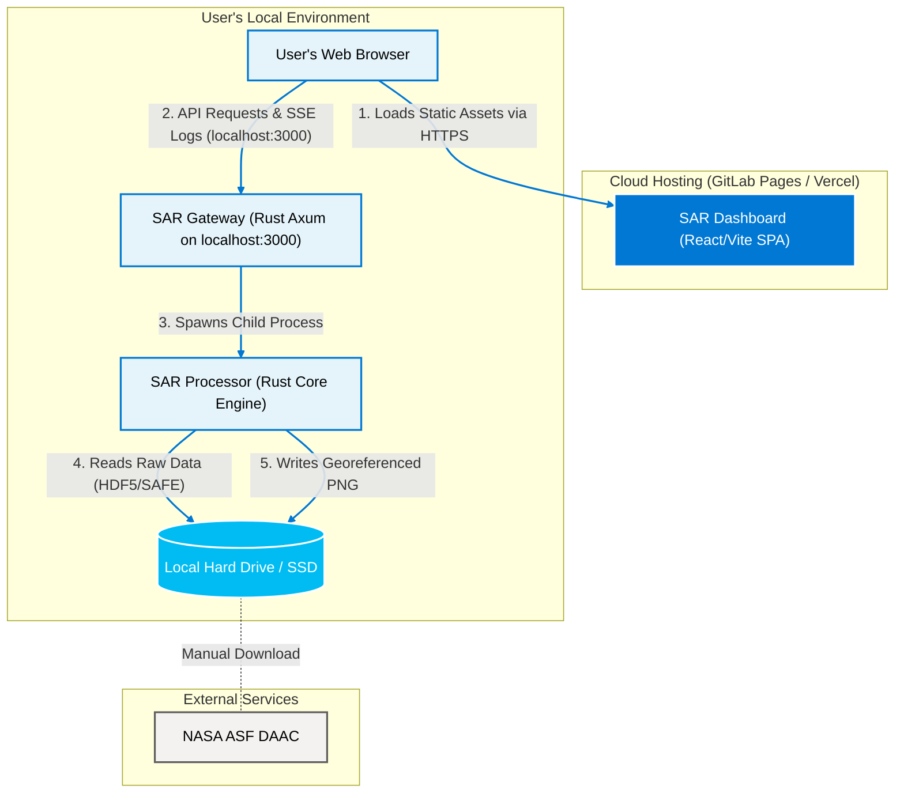
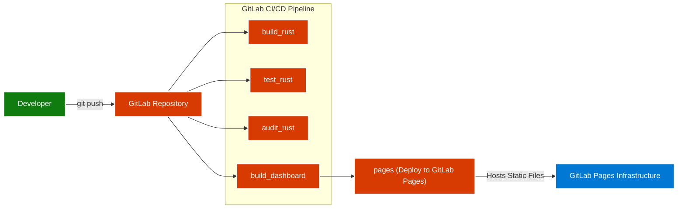
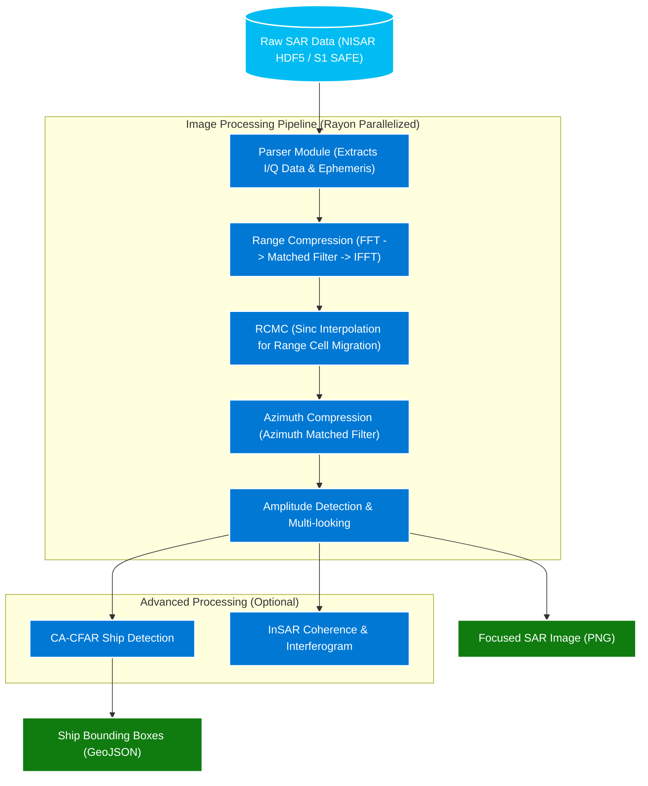
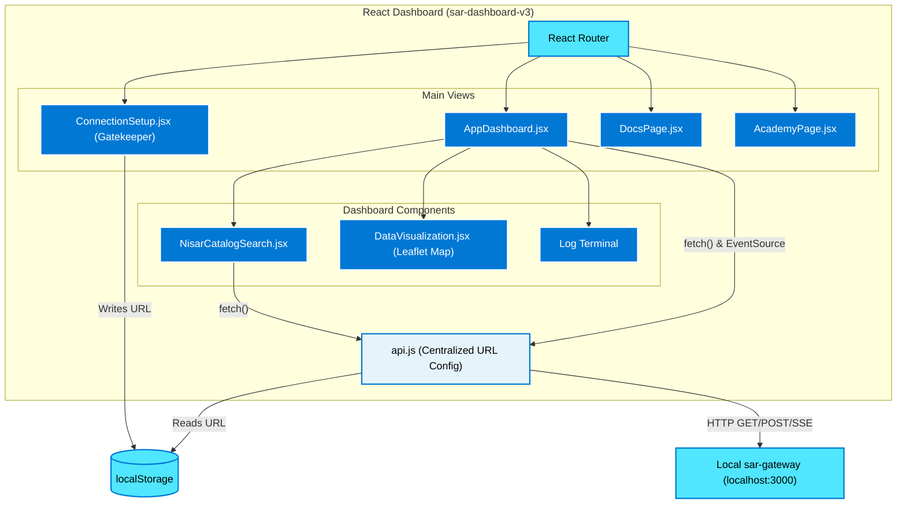
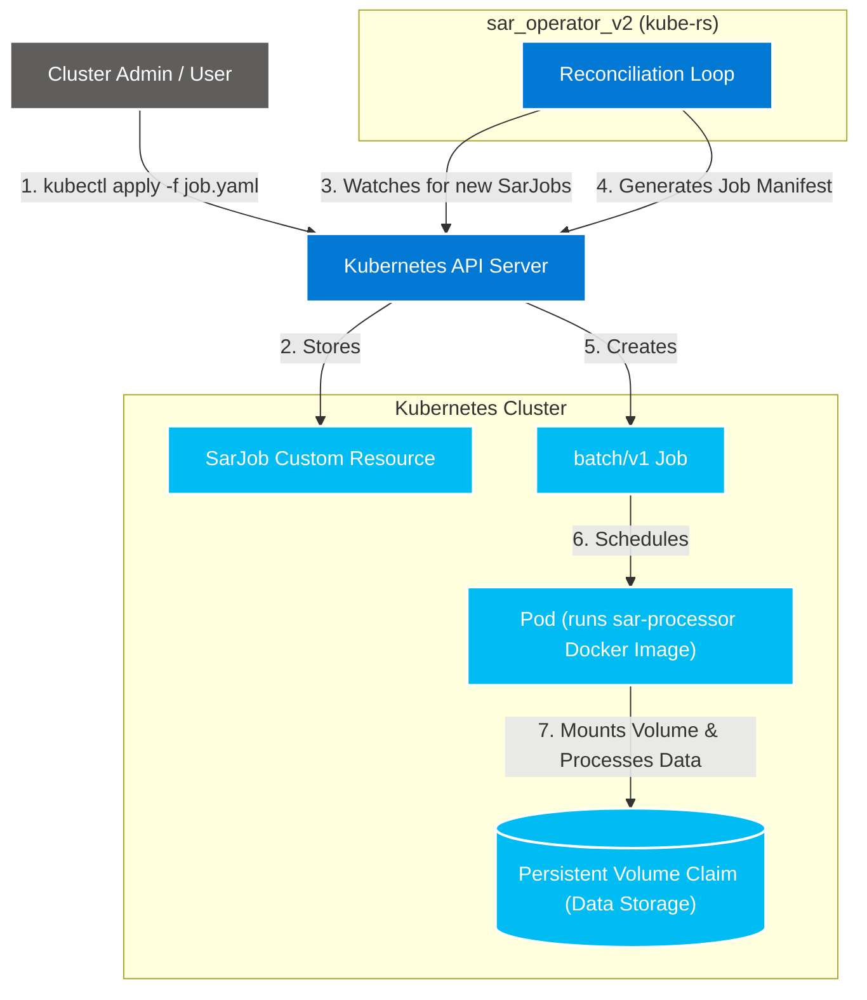

# NISARPro Architecture Diagrams
---

## 1. High-Level Architecture (Cloud Frontend + Local Backend)

This diagram shows the primary operating mode where the React dashboard is hosted statically in the cloud, while the heavy processing engine runs securely on the user's local machine (Zero-Upload Architecture).

---

## 2. Deployment Workflow (CI/CD)

This diagram illustrates what happens when code is pushed to the repository. The pipeline automatically runs tests, security audits, and deploys the frontend to GitLab Pages.

---

## 3. SAR Processor (The Math Engine)

This diagram details the internal processing pipeline of the `sar_processor` Rust binary. It shows how raw signal data is transformed into a focused image.

---

## 4. SAR Dashboard

This outlines the component structure of the React frontend, showing how it manages state and communicates with the backend.

---

## 5. SAR Operator (Kubernetes Mode)

For users running the platform in a Kubernetes environment instead of locally, this diagram shows how the custom `sar_operator_v2` manages workloads.

