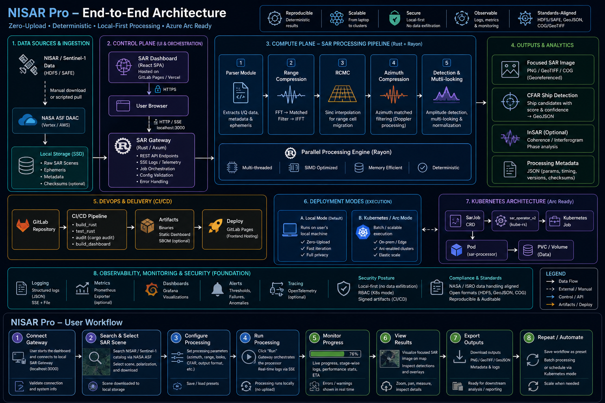
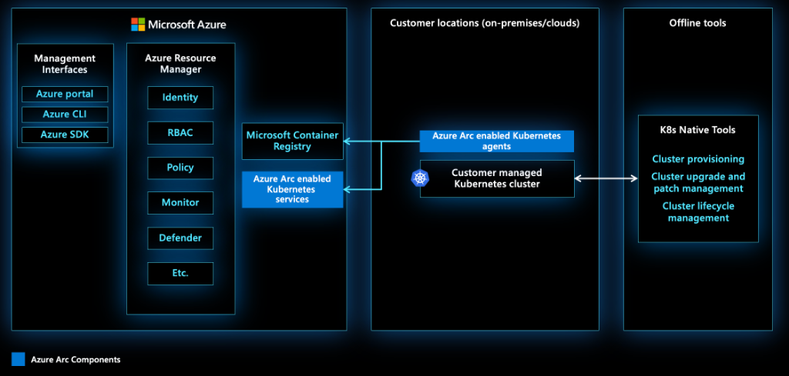

# NISARPro Architecture

> A high-level visual overview of the NISARPro platform.

## 1. High-Level Architecture (Cloud Frontend + Local Backend)

NISARPro uses a hybrid architecture designed for maximum data privacy and processing speed. The frontend dashboard is hosted globally, but all heavy radar data processing happens locally on your machine.

### Key Components:
- **Cloud Control Plane**: The React SPA hosted on GitLab Pages.
- **Local API Gateway**: The Rust server (`sar-gateway`) running on `localhost:3000` that acts as the bridge.
- **Compute Engine**: The `sar_processor` binary that executes the heavy mathematical algorithms (RDA, CFAR, InSAR).

---

## 2. User Workflow

The platform provides a streamlined 8-step workflow from data ingestion to geospatial insights.

### The 8 Steps:
1. **Connect Gateway**: Dashboard pings your local Rust server.
2. **Search & Select**: Find data via NASA ASF DAAC.
3. **Configure**: Select algorithms (InSAR, CFAR, etc.).
4. **Run**: Start the local processor.
5. **Monitor**: Watch real-time logs via SSE telemetry.
6. **View**: The focused image automatically overlays on the Leaflet map.
7. **Export**: Download results as GeoJSON or PNG.
8. **Automate**: (Optional) Batch process via Kubernetes.
