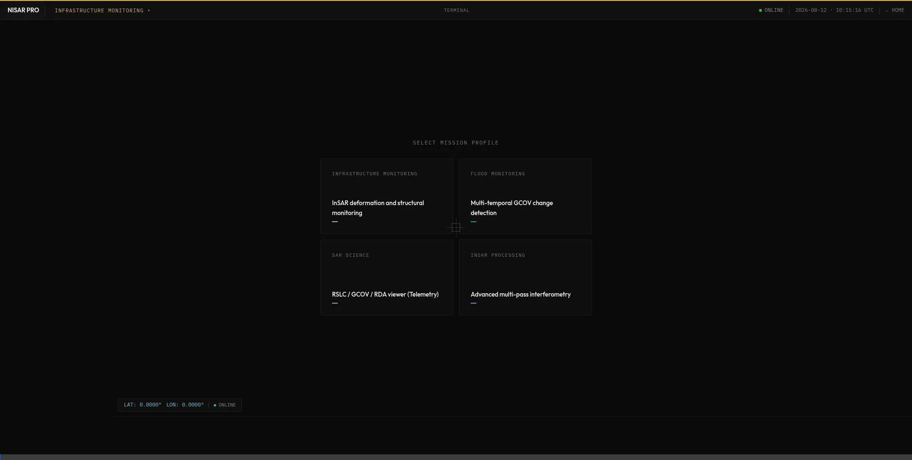
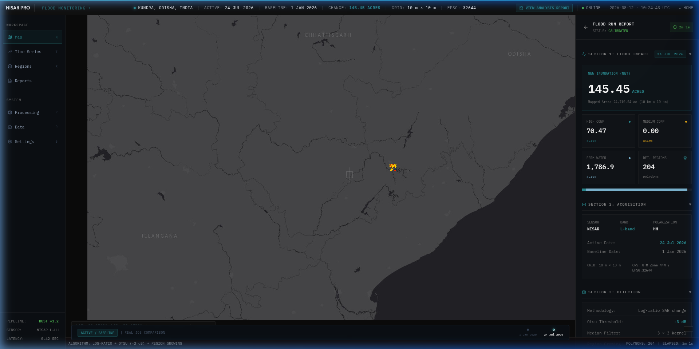

# 7-Stage SAR Flood & Inundation Detection Engine (`flood_detect.rs`)

The `flood_detect` module implements a scientifically rigorous, non-ML multi-temporal SAR flood extraction pipeline for NISAR L-band GCOV products.

## Algorithm Architecture

```
Stage 1: Metadata Pair Validation
   │
   ▼
Stage 2: Power-to-dB Conversion [10 * log10(P + ε)]
   │
   ▼
Stage 3: 3×3 Median Speckle Filtering
   │
   ▼
Stage 4: Log-Ratio Change Image (Δ_dB = active_dB - baseline_dB)
   │     + Otsu's Thresholding (with min_change_db floor)
   │
   ▼
Stage 5: Permanent Water Baseline Exclusion
   │
   ▼
Stage 6: Two-Threshold Region Growing (Seed + Growth)
   │     + 3×3 Morphological Open/Close & Connected Component Size Filter
   │
   ▼
Stage 7: Multi-Tier Confidence Scoring (0=Land, 1=Perm, 2=High, 3=Med, 4=Low)
```

## Unit Test Coverage
- `test_gcov_to_db`: Validates log transformation of real-valued covariance diagonal terms.
- `test_compute_change_image`: Verifies calibrated dB difference calculation.
- `test_otsu_threshold`: Verifies bimodal variance maximization for change separation.
- `test_region_grow_and_cleanup`: Verifies 8-connected region expansion and morphological size filtering.

## Output Exporters (`io.rs`)

### 1. Colormapped RGBA PNG (`save_flood_map_png`)
Generates a transparent overlay for web visualization:
- **Dry Land**: Completely transparent (`[0, 0, 0, 0]`)
- **Permanent Water**: Semi-transparent blue (`[0, 100, 255, 140]`)
- **High Confidence Flood**: Semi-opaque neon red (`[255, 40, 0, 220]`)
- **Medium Confidence Flood**: Semi-opaque orange (`[255, 160, 0, 180]`)
- **Low Confidence Flood**: Semi-opaque yellow (`[255, 230, 0, 120]`)

### 2. GeoJSON Feature Collection (`save_flood_geojson`)
Generates WGS84 coordinates polygon bounds for each flooded pixel cell to enable importing into standard GIS tools (QGIS, Google Earth) and displaying on maps. Includes `confidence` and `class_code` properties for each feature.

## CLI Parameters & Ingestion (`main.rs`)

The command line parser includes parameters to run the pipeline:
- `--mode flood`: Starts the 7-stage flood mapping pipeline.
- `--gunw <path>`: Optional geocoded unwrapped interferogram to merge coherence values into confidence scoring.
- `--min-change-db <f32>`: Minimum log-ratio backscatter decrease required to trigger a flood alert (default: `-3.0` dB, supports negative inputs).
- `--seed-threshold-db <f32>`: Initial seed selection limit (default: `-5.0` dB, supports negative inputs).
- `--growth-threshold-db <f32>`: Growth expansion threshold (default: `-2.5` dB, supports negative inputs).
- `--min-area-pixels <usize>`: Area floor to prune noise spikes (default: `8` pixels).

### Executable Invocation Examples
```bash
# GCOV dual-image change detection:
./target/release/sar_science_processor \
  --input active_gcov.h5 \
  --slave baseline_gcov.h5 \
  --mode flood \
  --crop-lat 18.7883 --crop-lon 82.6003 --crop-preset 10x10km \
  --output result_prefix

# With coherence mapping fusion and customized negative thresholds:
./target/release/sar_science_processor \
  --input active_gcov.h5 \
  --slave baseline_gcov.h5 \
  --gunw coherence_gunw.h5 \
  --mode flood \
  --min-change-db -3.0 --seed-threshold-db -5.0 --growth-threshold-db -2.5 \
  --crop-lat 18.7883 --crop-lon 82.6003 --crop-preset 10x10km \
  --output result_prefix
```

## Metadata & CRS Extraction
The science engine extracts the Coordinate Reference System (CRS) directly from the active HDF5 product metadata projection dataset (e.g. `epsg_code` attribute of `/science/LSAR/GCOV/grids/frequencyA/projection`).
* **Fallback**: Checks the coordinate ranges of grid axes. If values are within WGS84 degree boundaries (`[-90, 90]` and `[-180, 180]`), it resolves to `EPSG:4326`. Otherwise, it marks the CRS as `UNKNOWN`.
* **Output**: The extracted CRS string is written directly to the JSON report under the `"product.crs"` metadata key (e.g. `"crs": "EPSG:32644"`).

## Gateway Integration (`sar-gateway`)

The HTTP gateway integrates the flood mapping pipeline within `spawn_processing_job` in `jobs.rs`:
- **API Request Payload**: Expands `ProcessRequest` in `models.rs` to support the optional parameters `gunw_file`, `min_change_db`, `seed_threshold_db`, `growth_threshold_db`, and `min_area_pixels`.
- **Subprocess Dispatch**: Translates `pipeline: Some("flood")` and `processor: Some("science")` into the CLI execution call `./target/release/sar_science_processor --mode flood`, forwarding any custom threshold specifications.
- **Dynamic Artifact Paths**: Modifies job response payloads (`JobResponse` / `JobMetadata`) to directly return the generated report and vector overlay paths (`flood_report_path` and `flood_geojson_path`), eliminating hardcoded layout path logic on client frontends.
- **Structured Progress Streams**: Intercepts stdout log messages from the child process. The processor emits JSON progress events:
  ```json
  {"event":"progress","stage":"SUBMITTED"|"PROCESSING"|"GENERATING_OUTPUTS"|"COMPLETE"|"FAILED","message":"..."}
  ```
  The gateway broadcasts these events directly to EventSource SSE clients.

## Frontend Dashboard Integration (`sar-dashboard-v3`)

The dashboard exposes the interactive controls and renders the flood mapping results:
- **Pipeline Selector**: Adds `Flood & Inundation` mode to the available processing pipelines list for `sar_science` profile.
- **Geographic Crops & Inputs**: Exposes coordinate inputs, crop presets (`1x1km` to `20x20km`), baseline GCOV path, and optional coherence (GUNW) HDF5 paths.
- **Advanced Threshold Controls**: Adds collapsible sliders for parameters.
- **Job Status Polling**: On completion, retrieves both the classification report JSON and vector GeoJSON directly from the backend paths (`flood_report_path` and `flood_geojson_path`).
- **Dynamic Terminal Output**: Automatically parses JSON progress messages in the terminal drawer to render beautifully colorized, human-readable logging lines (e.g. `[PROCESSING] [1/5] Loading active product...`) rather than raw JSON strings.
- **Emergency Advisory HUD**: Displays a dedicated pulsing **District Emergency Advisory Card** when a completed flood job is viewed. It contains a high-level summary of baseline vs. active dates, total acres inundated, permanent water coverage, confidence levels, and the metadata-supplied CRS.
- **Leaflet Image Overlay**: Intercepts the transparent overlay output (`_flood.png`) and renders it atop the Leaflet base layer at the computed georeferenced bounding box.
- **Fallback Screens**: If the classification report or output files are missing or failed to fetch, the dashboard displays an elegant `RESULT DATA UNAVAILABLE` panel in the details drawer, preventing blank panels or template value bleed.
- **Centroid Zoom**: Parses polygon and multipolygon vertices dynamically in `AppDashboard` to compute the geometric centroid center of mass when centering maps on selected flood features.

---

## Visual Pipeline Execution

Below is an interactive visual walkthrough of the end-to-end processing pipeline, from initial data load parameters configuration to complete vector analysis results rendering.

### 📹 Screen Recording
Dynamic record showing the complete workflow run (form submission, live progress logs streaming, completion callback, and Leaflet rendering):


### 🖼️ Map Vector Overlay & Emergency Advisory HUD
Dashboard display showing the colormapped classification raster overlaid on the map and the Emergency Advisory HUD loaded with real metrics:
