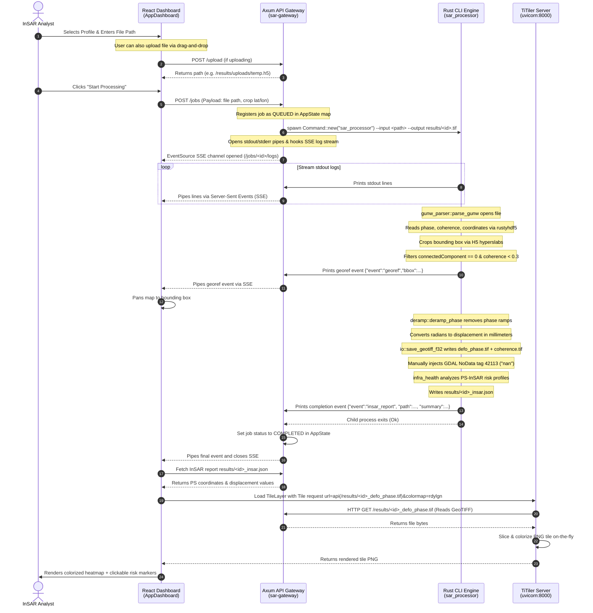

# End-to-End GUNW Data Flow & Lifecycle Trace

This document describes the complete lifecycle of a Geocoded Unwrapped Interferogram (GUNW) HDF5 file as it travels through the NISAR Pro system — from the browser dashboard, through the API gateway, into the Rust signal processing engine, and back to the Leaflet map rendering layer.

---

## 🗺️ Architectural Trace Diagram

The following sequence diagram maps the execution sequence across the system layers:



---

## 🛠️ Step-by-Step Execution Mechanics

### Step 1: User Ingest & Selection (React Dashboard)
* **Ingest Options**: 
  1. The user inputs a path directly into the dashboard (`AppDashboard.jsx`).
  2. The user drags and drops a local HDF5 file. The file is uploaded to the gateway (`sar-gateway/src/handlers.rs`'s `upload_file` endpoint) via a multipart form POST request to `/upload`. The gateway saves the file to `./results/uploads/temp.h5` and returns this absolute path to the client.
* **Metadata Extraction**: The React client runs `parseNisarFilename()` helper to extract acquisition date, polarization, and instrument details from the filename pattern.
* **Target Coordinates**: If the user searches for an asset (e.g. *Upper Kolab Dam*), the map flies to the coordinates, and the dashboard queries environmental data from `/context?lat=...&lon=...` to display geotechnical telemetry.
* **Processing Trigger**: Clicking **START PROCESSING** issues a POST request to the gateway at `/jobs` with the parameters:
  ```json
  {
    "input_file": "/home/aditya/Desktop/nisar_data/NISAR_L2_PR_GUNW_....h5",
    "pipeline": "insar",
    "crop_lat": 18.7889,
    "crop_lon": 82.6049,
    "crop_radius_km": 10.0
  }
  ```

---

### Step 2: Job Scheduling & Subprocess Spawning (API Gateway)
* **Job Registry**: The gateway Axum handler (`create_job` inside `sar-gateway/src/handlers.rs`) parses the request and registers a new `JobMetadata` entry in the global `state.jobs` RwLock map.
* **Process Execution**: The supervisor spawns `sar_processor` as an asynchronous child process using `tokio::process::Command`:
  ```bash
  sar_processor \
    --input /home/aditya/Desktop/nisar_data/NISAR_L2_PR_GUNW_....h5 \
    --output results/sar-f83d2a1b.tif \
    --polarization HH \
    --crop-lat 18.7889 \
    --crop-lon 82.6049 \
    --crop-radius-km 10.0
  ```
* **Log Pipes & Event Sourcing**: The gateway hooks the child process's stdout and stderr streams. It launches an async reader loop that broadcasts logs to an Axum Server-Sent Events (SSE) stream (`/jobs/:id/logs`), allowing the client terminal to update in real-time.

---

### Step 3: Science Pipeline & Data Parsing (Rust Compute Engine)
* **CLI parsing**: The compiled Rust binary `sar_processor` starts. Its entrypoint (`sar_processor/src/main.rs`) parses flags using `clap`.
* **GUNW Fast-Path**: Because the filename contains `_GUNW_` (signaling pre-computed interferograms), the engine bypasses the range compression and azimuth focusing steps, jumping straight to `gunw_parser::parse_gunw`.
* **HDF5 Ingest**:
  * The parser opens the target HDF5 file using the pure-Rust `rustyhdf5` library.
  * It maps datasets:
    * Unwrapped Phase: `/science/LSAR/GUNW/grids/frequencyA/numberOfLooks1/unwrappedPhase`
    * Coherence: `/science/LSAR/GUNW/grids/frequencyA/numberOfLooks1/coherence`
  * **Hyperslab Cropping**: If `crop_lat` and `crop_lon` were supplied, the parser maps coordinates to grid column/row offsets. Rather than reading the entire 30 GB file, it loads only the cropped sub-matrix indices via sliced HDF5 hyper-slab reads.
* **Data Masking**:
  * Unwrapping failures are identified by connected component IDs equal to 0 and are masked out as `f32::NAN`.
  * Pixels with coherence values less than 0.3 are masked out to filter out water and dense vegetation noise.

---

### Step 4: Phase Deramping, Scaling & Output Creation
* **Quadratic Deramping**: To remove regional phase ramps caused by orbital tilt or atmospheric delays, `sar_processor::deramp::deramp_phase` fits a 2D quadratic surface using iterative robust least-squares (outliers exceeding $2.5\sigma_{\text{MAD}}$ are rejected over 3 iterations).
* **Millimeter Conversion**: The cleaned phase is scaled to displacement in millimeters:
  $$\text{displacement} = \frac{\phi_{\text{clean}} \cdot \lambda \cdot 1000}{4\pi}$$
* **GeoTIFF Generation (`sar_processor/src/io.rs`)**:
  * The f32 arrays are written as GeoTIFF files: `results/sar-f83d2a1b_defo_phase.tif` and `results/sar-f83d2a1b_coherence.tif`.
  * The writer manually injects GDAL metadata tag `42113` with the value `"nan\0"` to configure standard NoData handling.
* **Risk Categorization**:
  * `sar_processor::infra_health::analyze_infrastructure_unwrapped` classifies persistent scatterer points (coherence $\geq 0.85$) into risk levels (Stable, Caution, Alert, Critical) using a standard deviation threshold (MAD-based, minimum floor of 2.0 mm).
  * Writes the coordinates list and risk values to `results/sar-f83d2a1b_insar.json`.
* **Events Emission**: The engine prints structured JSON strings to stdout before exiting:
  * `{"event":"georef","bbox":{"south":...,"north":...}}`
  * `{"event":"insar_report","path":"results/sar-f83d2a1b_insar.json","summary":...}`

---

### Step 5: Map Rendering (React Leaflet & TiTiler)
* **Map Centering**: The dashboard intercepts the `georef` SSE event and centers the map on the bounding box.
* **Scatterer Overlays**: The client fetches the InSAR report JSON from the gateway. It parses the coordinates list and overlays them on the map using `<CircleMarker>` elements, color-coded by risk level (Stable = Green, Critical = Red).
* **Raster Overlays**: The dashboard loads the continuous displacement heatmap using a Leaflet `<TileLayer>` pointing at TiTiler:
  ```
  http://localhost:8000/cog/tiles/WebMercatorQuad/{z}/{x}/{y}?url=http://localhost:3000/results/sar-f83d2a1b_defo_phase.tif&colormap_name=rdylgn&rescale=-20,20
  ```
  * TiTiler fetches the target GeoTIFF from the gateway's static static server `/results/...` proxy.
  * It colorizes the slice using the diverging `rdylgn` (Red-Yellow-Green) colormap, and returns a 256x256 or 512x512 tile image back to Leaflet.
