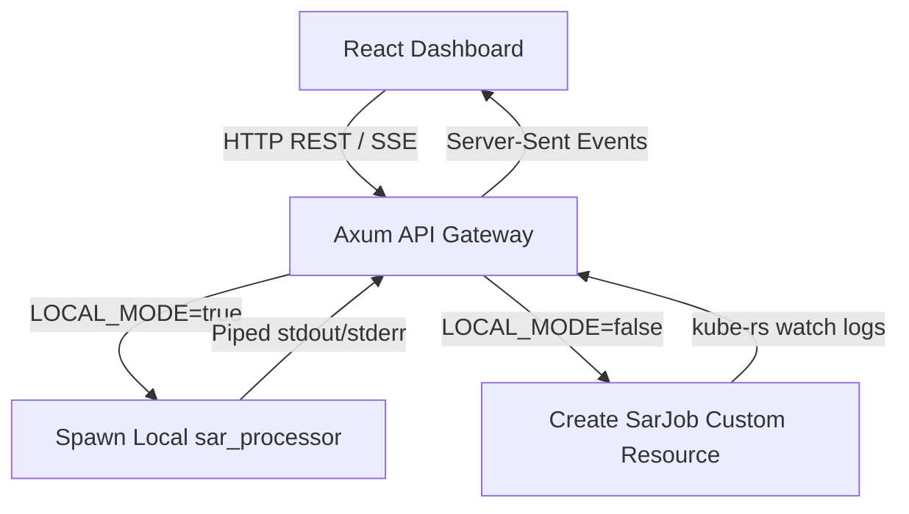

# SAR Gateway Component Internals

> Location: `sar-gateway/src/` — Multi-threaded asynchronous API gateway and job supervisor.

---

## 1. Component Overview

The `sar-gateway` acts as the coordinator for the entire platform. It is written in Rust using the **Axum** web framework and the **Tokio** runtime. It bridges the React dashboard control plane (UI) to the underlying compute engine (CLI/K8s).

It runs in two distinct modes depending on the deployment environment:
1. **Local Subprocess Mode (Dev/Single-VM)**: Spawns the compiled `sar_processor` binary directly on the host machine using standard I/O pipes.
2. **Kubernetes Mode (Cloud/Production)**: Submits custom `SarJob` Custom Resources (CRDs) to a Kubernetes API server via the `kube-rs` client.



---

## 2. Updated Directory Mapping

```
sar-gateway/src/
├── main.rs         → Server instantiation, AppState initialization, router setup & static file serving
├── handlers.rs     → Axum HTTP handlers (search, metadata, environmental context, and SSE streams)
├── jobs.rs         → Async job orchestrator (local subprocess supervisor vs K8s CRD scheduler)
├── models.rs       → Strongly typed request/response payload definitions (JSON serialization)
├── esa_client.rs   → Copernicus OData API proxy client (Sentinel-1 query engine)
└── nasa_client.rs  → NASA ASF Vertex query client (NISAR product query engine)
```

---

## 3. REST & Event Streaming API

The gateway exposes a clean REST API layer alongside Server-Sent Events (SSE) for log streaming:

| Method | Endpoint | Description |
| :--- | :--- | :--- |
| `GET` | `/jobs/health-ping` | System status verification ping (returns `{"status":"ok"}`) |
| `GET` | `/assets/search` | Queries pre-defined critical infrastructure coordinates (e.g. Upper Kolab, Indravati) |
| `GET` | `/context` | Queries dynamic weather and reservoir level telemetry for assets |
| `GET` | `/search/nisar` | Queries NASA ASF for NISAR H5 products matching filters |
| `POST` | `/jobs` | Submits a processing job (takes master/slave files, returns a job UUID) |
| `GET` | `/jobs/:id` | Polls job execution phase, bounding box coordinates, and output file paths |
| `POST` | `/jobs/:id/cancel` | Requests termination of an executing local subprocess or K8s Pod |
| `GET` | `/jobs/:id/logs` | Establishes a persistent SSE channel streaming logs from the processor in real-time |
| `GET` | `/results/*` | Static file service exposing the `./results` folder (crucial for TiTiler HTTP access) |

---

## 4. Local Execution & SSE Logging Pipeline

In Local Mode (`LOCAL_MODE=true`), the gateway handles jobs asynchronously to prevent blocking the HTTP threads:

1. **Job Queuing**: When a `/jobs` POST request arrives, a unique Job ID is generated (e.g., `sar-f83d2a1b`).
2. **AppState Registration**: A `JobMetadata` object containing status, logs vector, and a broadcast channel is inserted into a thread-safe global `AppState` map (`Arc<RwLock<HashMap>>`).
3. **Subprocess Spawn**: `tokio::spawn` launches the binary as a child process:
   ```bash
   ../sar_processor/target/release/sar_processor --input <IN> --output results/<ID>.tif
   ```
4. **Log Streaming & Event Sniffing**:
   * Standard output is read line-by-line via `BufReader`.
   * The gateway scans lines for structured georeferencing JSON outputs:
     `{"event":"georef","bbox":{"south":...,"north":...}}`
     When found, it parses the bbox coordinates and stores them in the job metadata for Leaflet alignment.
   * All other log lines are pushed to the in-memory array and broadcasted to any connected SSE event loops.
5. **SSE Connection Replay**: If the browser reconnects to `/jobs/:id/logs` after processing has started, the handler replays all cached log lines first before piping new log streams, ensuring the UI terminal never drops logs.
