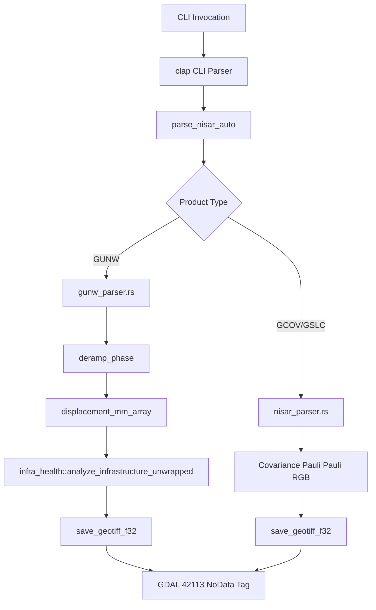

# SAR Processor Component Internals

> Location: `sar_processor/src/` — High-performance, stateless Synthetic Aperture Radar (SAR) compute engine.

---

## 1. Component Overview

The `sar_processor` is a stateless, pure-Rust command-line tool responsible for the core signal processing, radar science telemetry extraction, and geospatial visualization output. It executes heavy mathematical operations on ND-arrays, parallelized across multiple CPU cores via `rayon`.

Unlike traditional GIS/SAR pipelines that rely on Python wrapper scripts and native C++ binaries, the processor is a single compiled binary with **zero Python or C library runtime dependencies**.



---

## 2. Updated Directory Mapping

Following the recent architectural simplification, the codebase has been streamlined:

```
sar_processor/src/
├── main.rs         → CLI dispatcher, execution controller & SSE stdout event emitter
├── lib.rs          → Public module declarations
├── io.rs           → Pure-Rust GeoTIFF writer with inline ASCII tags & NoData metadata
├── nisar_parser.rs → Coordinate transformation and HDF5 covariance parser
├── gunw_parser.rs  → Unwrapped interferogram (GUNW) parser with CC and coherence masking
├── deramp.rs       → Iterative robust quadratic 2D surface fitting & orbit phase deramping
├── infra_health.rs → PS-InSAR classification, structural risk metrics, & alert generator
├── ship_detection.rs → O(1) Integral-image-accelerated CA-CFAR target classifier
├── coregister.rs   → Sinc-interpolated sub-pixel image coregistrator
├── water_mask.rs   → SWBD external mask loader & low-coherence proxy masking
├── errors.rs       → Standardized anyhow/thiserror custom error variants
└── archive/        → Legacy algorithms (RDA, RCMC, validation scripts) kept for reference
```

---

## 3. Key Core Modules & Algorithms

### 3.1. Pure-Rust HDF5 Reader (`rustyhdf5` & `rustyhdf5-format`)
To eliminate the painful compilation requirement of native C/C++ libraries (such as `libhdf5-dev`), the processor uses a pure-Rust HDF5 implementation.
* **Benefit**: Safe, compile-once, run-anywhere binary with zero dynamic library linking issues at runtime.
* **Mechanism**: Maps HDF5 files to low-level byte buffers, extracting complex compound datasets (like compound `{r: f32, i: f32}` for SLC arrays) using zero-copy slicing.

### 3.2. Phase-to-Displacement Scaling (Millimeters)
Radar phase difference ($\phi$, in radians) is converted to line-of-sight displacement in millimeters using the specific carrier wavelength ($\lambda$) of the L-band radar:

$$\text{displacement}_{\text{mm}} = \frac{\phi \cdot \lambda \cdot 1000}{4\pi}$$

* **Pipeline Execution**: The raw radians are preserved during PS-InSAR infrastructure safety modeling (to prevent double-scaling), but the final written GeoTIFF file (`_defo_phase.tif`) contains real displacement scaled in millimeters.

### 3.3. GDAL NoData Tag (42113) Support
To ensure standard GIS software (QGIS, ArcGIS, TiTiler) does not render out-of-bounds or masked pixels (water, low-coherence regions):
* **`io.rs`** manually injects the standard GDAL metadata tag `42113` with the ASCII value `"nan\0"`.
* The TIFF Image File Directory (IFD) dynamically expands inline, preventing memory allocation underflows.

### 3.4. 2D Iterative Robust Deramping (`deramp.rs`)
Compensates for orbital errors, ionospheric phase ramps, and topographic distortions by fitting a quadratic surface:

$$\phi(x,y) = a_0 + a_1 x + a_2 y + a_3 x^2 + a_4 y^2 + a_5 xy$$

* Fits using least-squares, then runs a 3-iteration robust loop.
* Rejects outliers exceeding $2.5\sigma$ based on the Median Absolute Deviation ($\sigma_{\text{MAD}} = 1.4826 \times \text{MAD}$), shielding the orbit fit from localized tectonic/subsidence signals.

---

## 4. Simplified Command Line Interface (CLI)

The old, complex CLI flags (`--synthetic`, `--no-rcmc`) have been removed. The simplified engine expects pre-focused HDF5 files directly:

```
Usage: sar_processor [OPTIONS] --input <FILE>

Options:
  -i, --input <FILE>                  Input file: NISAR HDF5 (.h5) — GSLC, GCOV, or GUNW
      --insar-slave <SLAVE_FILE>      Secondary input file for two-pass InSAR (Slave image)
  -o, --output <OUTPUT>               Output GeoTIFF path [default: focused_sar.tif]
  -p, --polarization <POLAR>          Polarisation channel (HH, VV, HV, VH) [default: HH]
      --tiles-dir <TILES_DIR>         Output directory for XYZ Web Tiles
      --ship-detect                   Run CA-CFAR maritime ship detection
      --crop-lat <LAT>                Center latitude to crop (for spatial filtering)
      --crop-lon <LON>                Center longitude to crop
      --crop-radius-km <RADIUS>       Radius of spatial crop in kilometers [default: 10.0]
```
