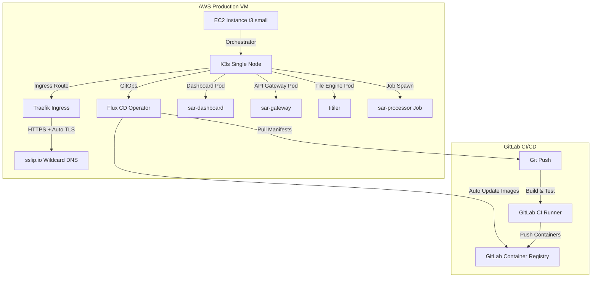

# Deployment Guide

This guide describes how to deploy the NISARPro Synthetic Aperture Radar (SAR) processing platform to AWS using Infrastructure as Code (IaC) with **Terraform**, lightweight Kubernetes with **K3s**, and GitOps deployment with **Flux CD**.

---

## Architecture Topology

The production setup uses a local-compute / cloud-native hybrid topology optimized for minimum monthly operational cost. It deploys all components onto a single, high-efficiency cloud VM instance.



---

## 1. Cloud Infrastructure (Terraform IaC)

All infrastructure is defined in the `infra/` directory.

### Requirements
1. Installed **Terraform CLI** (`>= 1.5.0`)
2. Configured **AWS CLI** with credentials

### Provisioning Steps
```bash
# 1. Initialize providers (AWS)
cd infra/
terraform init

# 2. Review resources to be created
terraform plan

# 3. Apply infrastructure configurations
terraform apply -auto-approve
```

### Resources Created
* **VPC & Subnets**: Single public subnet (saves ~$32/month NAT Gateway fees).
* **Security Group**: Open ports `22` (SSH), `80` (HTTP), and `443` (HTTPS) with restrictiveness.
* **EC2 Instance**: `t3.small` (x86_64, 2 vCPU, 2 GiB RAM).
* **EBS Storage**: `20 GB gp3` SSD volume for OS, container cache, and output TIFFs.
* **User Data Initialization**: Automates K3s install, creates namespaces, and deploys Flux bootstrap.

---

## 2. Kubernetes Setup (K3s)

The VM is bootstrapped using K3s, a lightweight 100% compliant Kubernetes distribution requiring less than 512MB RAM overhead.

### Cluster Verification
Connect to the instance using the SSH key generated during the Terraform run:
```bash
# Retrieve public IP from Terraform outputs
export EC2_IP=$(terraform output -raw ec2_public_ip)

# SSH into the host
ssh -i key.pem ubuntu@$EC2_IP

# Verify cluster status
sudo kubectl get nodes
```

---

## 3. GitOps Configuration (Flux CD)

Flux CD synchronizes the cluster state with the `k8s/` directory in the GitLab repository.

### Bootstrap Execution (Automated)
Terraform's `user_data.sh` automatically bootstraps Flux inside the cluster. To run it manually:
```bash
flux bootstrap gitlab \
  --owner=Aditya-Narayan-Nayak \
  --repository=nisar_pro \
  --branch=main \
  --path=k8s/flux-system \
  --deploy-token-auth
```

### Synchronization Verification
To monitor synchronization loops and status changes:
```bash
sudo flux get kustomizations
sudo kubectl get pods -n nisarpro
```

---

## 4. Ingress Routing & Automated TLS

K3s ships with the **Traefik Ingress Controller** by default. We configure Traefik to handle incoming HTTP/HTTPS requests and dynamically obtain SSL/TLS certificates via **Let's Encrypt** (ACME).

### Wildcard DNS mapping via `sslip.io`
Since this is a showcase environment, we utilize `sslip.io` to map our dynamic EC2 public IP to a DNS host instantly without buying a domain:
```
http://${EC2_IP}.sslip.io -> Routes directly to your EC2 public IP
```
Traefik interceptors automatically read this domain, negotiate a Let's Encrypt certificate, and upgrade the connection to **HTTPS** (`https://${EC2_IP}.sslip.io`).

---

## 5. GitLab CI/CD Pipeline

The CI/CD pipeline defined in `.gitlab-ci.yml` is divided into three stages:

1. **Build**: Compiles Rust binaries (`sar_processor`, `sar-gateway`) and builds the React static bundle.
2. **Test**: Runs cargo unit tests and frontend linters.
3. **Containerize & Push**: Builds Docker images using the multi-stage Dockerfiles and pushes them to the **GitLab Container Registry**:
   * `registry.gitlab.com/aditya-narayan-nayak/nisar_pro/sar-dashboard:latest`
   * `registry.gitlab.com/aditya-narayan-nayak/nisar_pro/sar-gateway:latest`
   * `registry.gitlab.com/aditya-narayan-nayak/nisar_pro/sar-processor:latest`
   * `registry.gitlab.com/aditya-narayan-nayak/nisar_pro/titiler:latest`

Flux CD monitors the registry and automatically updates the deployments when a new container tag is pushed.

---

## 6. Estimated Monthly Cost Breakdown

| Resource | Scope | Monthly Cost |
| :--- | :--- | :---: |
| **AWS EC2 Instance** | `t3.small` On-Demand | ~$15.00 (or **$0** if Free-Tier eligible) |
| **AWS EBS Storage** | 20 GB gp3 SSD | ~$1.60 |
| **AWS Elastic IP** | Public IPv4 address allocation | ~$3.65 |
| **Let's Encrypt Certs** | Auto-renewing SSL/TLS | $0.00 |
| **GitLab Container Registry** | Image hosting | $0.00 |
| **Total Estimated Cost** | **Minimal Sandbox** | **~$5.25 - $20.25 / month** |
